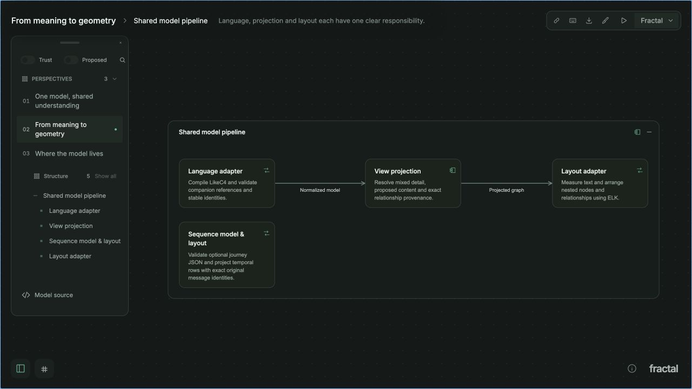

# Fractal

**Explore your software. Explain it clearly.**

Fractal turns a text model of your system into an interactive architecture studio. Start with the
big picture, open a component to follow the detail, and walk through a sequence of interactions.
Export the same view as a crisp SVG or 4K PNG when it's time to share it.



- **Explore at your own depth.** Expand components, focus a subsystem, search connections and follow their sources.
- **Tell a clear story.** Save perspectives, present them in order, and distinguish current architecture from proposals.
- **See boundaries and journeys.** Inspect overlapping ownership and trust boundaries alongside sequence diagrams.
- **Work locally, in text.** Keep models with the code they describe. No account, hosted service or API key required.
- **Give agents the same tools.** Validate, inspect, search, lay out and export through a non-interactive CLI with JSON output.

Fractal uses [LikeC4](https://likec4.dev/) for architecture authoring, plus a small JSON companion for
scenes and boundaries. The model format is experimental and may change.

## Up and running

Install **Node.js 22.22.3 or later** and npm, then:

```sh
git clone https://github.com/marcus/fractal.git
cd fractal
npm ci
npm run dev -- --host 127.0.0.1 --port 5199 --strictPort
```

Open [localhost:5199](http://127.0.0.1:5199). The bundled examples work immediately when you have no
configured catalog. Pick a perspective, expand a component, and try **Cmd/Ctrl+K** to jump to a
component or connection. Press **?** for keyboard shortcuts.

The development studio supports macOS and Linux. The optional persistent service is
macOS-only: stop the development server, then run `bin/fractal service install` to start at login.
See the [local service guide](docs/guides/active/local-service.md). Keep the studio loopback-bound;
it has no authentication.

SVG exports work after `npm ci`. PNG exports need Chromium:

```sh
npx playwright install chromium
```

## Model your own project

Copy a small example into the project it describes:

```sh
mkdir -p /path/to/project/docs/diagrams/fractal
cp examples/observatory/* /path/to/project/docs/diagrams/fractal/
```

Edit `model.c4` for elements and relationships. In `fractal.json`, set `id` to your project's slug
and update the title, provenance and saved scenes. Optional `sequences.json` describes ordered
journeys. The [model format guide](docs/guides/active/model-format.md) explains the files.

Validate from the Fractal checkout:

```sh
bin/fractal validate --directory /path/to/project/docs/diagrams/fractal --json
```

To open the model, create `~/.config/fractal/catalog.json` with the following content, or add the
entry to your existing `projects` list. Use an absolute directory and the same ID as `fractal.json`:

```json
{
  "version": 1,
  "projects": [{ "id": "product", "directory": "/path/to/project/docs/diagrams/fractal" }]
}
```

Reload the studio, choose your project with **Cmd/Ctrl+Shift+K**, and open its overview. After
further edits, use **Model source → Reload model**. A catalog supplies the project's list;
it replaces the bundled examples. [Catalog options](skills/fractal/SKILL.md#register-and-open-an-interactive-model)
include an alternate file via `FRACTAL_CATALOG`.

Export a scene:

```sh
bin/fractal export --directory /path/to/project/docs/diagrams/fractal --scene overview \
  --theme graphite --output overview.svg
bin/fractal export --directory /path/to/project/docs/diagrams/fractal --scene overview \
  --format png --output overview.png
```

## For agents

Give your agent the repository's [Fractal skill](skills/fractal/SKILL.md). It covers authoring,
source evidence, stable identities, validation, catalog registration and visual review, without
requiring a particular agent or model provider.

A useful first instruction:

> Read `skills/fractal/SKILL.md` in my Fractal checkout. Inspect my project's source, then create
> an architecture model in its `docs/diagrams/fractal/` directory. Include a concise overview and
> one useful drilldown. Cite the source files you used, mark proposals explicitly, validate every
> scene, and export an SVG for review.

Agents can work without starting the studio:

```sh
bin/fractal --help
bin/fractal validate --directory examples/observatory --json
bin/fractal inspect --directory examples/observatory --json
bin/fractal search --directory examples/observatory --query ingestion --json
bin/fractal export --directory examples/observatory --scene overview --output observatory.svg
```

`bin/fractal` runs from any directory and writes clean machine-readable stdout.
`npm run cli -- <command>` runs model commands from the checkout, with npm’s usual script banner.
Use `bin/fractal service ...` for service management.

| Commands                      | Purpose                                              |
| ----------------------------- | ---------------------------------------------------- |
| `projects`, `validate`        | Discover models and validate all saved scenes        |
| `inspect`, `search`           | Read elements, relationships and provenance          |
| `project`, `layout`, `export` | Project a view, compute geometry, produce SVG or PNG |
| `journeys`, `journey`         | Discover and inspect sequence journeys               |
| `sequence`, `sequence-export` | Lay out and export sequences                         |
| `themes`, `shortcuts`         | Discover themes and keyboard controls                |
| `service`                     | Manage the persistent macOS studio                   |

The [CLI reference](docs/guides/active/cli.md) documents the full command contract. Errors use JSON
on stderr and a nonzero exit status.

## Learn more and contribute

- [Using the studio](docs/guides/active/studio.md)
- [Model format](docs/guides/active/model-format.md) and [sequence journeys](docs/guides/active/sequences.md)
- [Architecture](docs/guides/active/architecture.md) and [product direction](docs/plans/active/fractal.md)
- [Contributing](CONTRIBUTING.md), [design principles](DESIGN.md) and [agent engineering guide](AGENTS.md)
- [Security](SECURITY.md)

Bug reports, thoughtful examples and small contributions are welcome. To develop locally:

```sh
npm run check
npm test
npm run build
npm run test:browser
```

Run `npm run docs` after changing CLI help. With a studio running, `npm run record:demo` records
the demo perspectives into `artifacts/`.

## License and credits

Fractal is [Apache 2.0 licensed](LICENSE). Built with [LikeC4](https://likec4.dev/),
[Svelte](https://svelte.dev/), [ELK](https://eclipse.dev/elk/), [Inter](https://rsms.me/inter/)
and [Roc](https://github.com/marcus/roc). See [third-party notices](THIRD_PARTY_NOTICES.md).

Made by [Marcus Vorwaller](https://github.com/marcus) at [Haplab](https://haplab.com).
